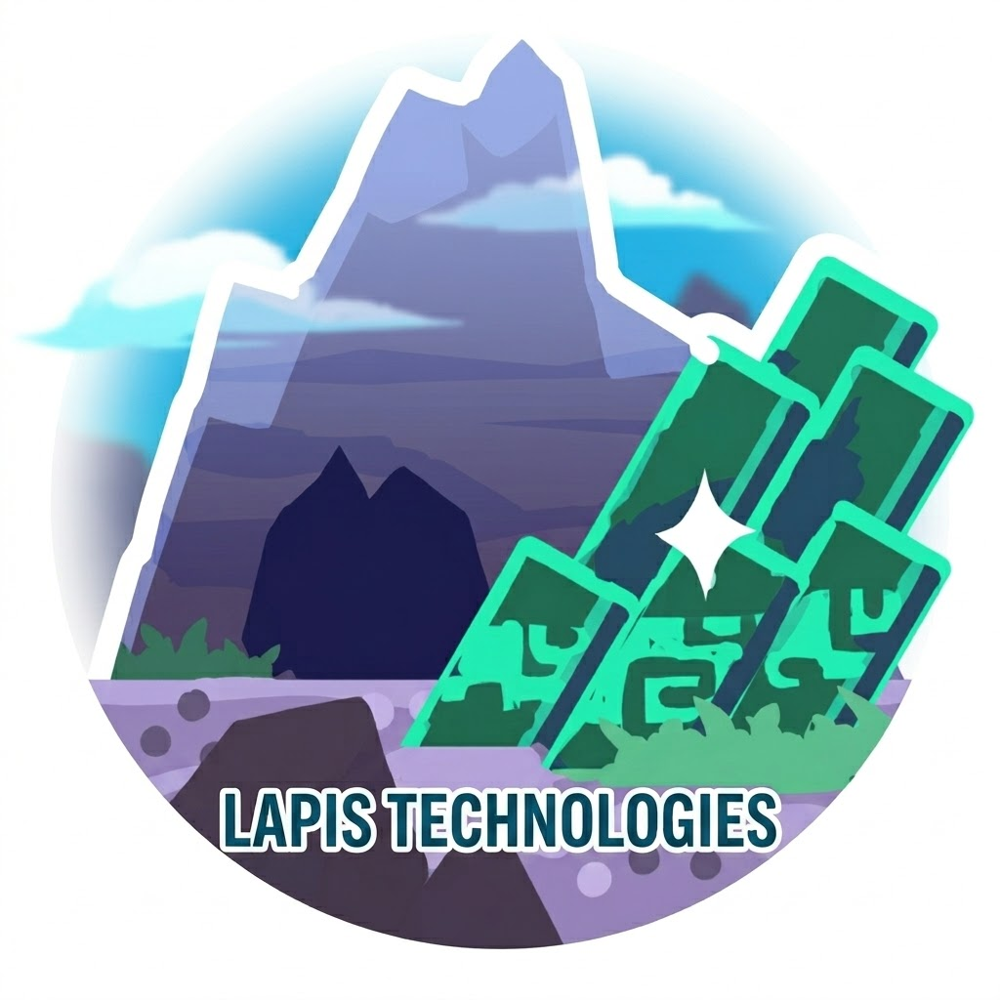
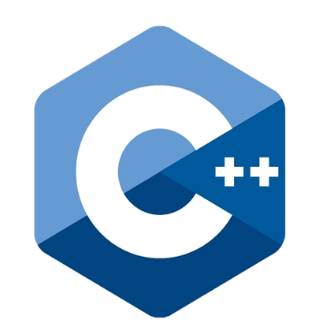
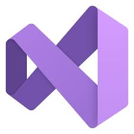
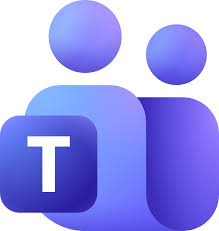

<div align="center">



# Lapis Technologies

</div>

<div align="center">


</div>

<div align="center">
  
  
  
  
  
</div>

## Table of Contents

- [Overview](#overview)
  - [Goals](#goals)
  - [How It Works](#how-it-works)
  - [Architecture](#architecture)
- [Getting Started](#getting-started)
  - [Prerequisites](#prerequisites)
  - [Installation](#installation)
  - [Building](#building)
  - [Tests](#tests)
  - [Portable EXE](#portable-exe)
- [Project Structure](#project-structure)
- [Documentation](#documentation)
- [Team Roles](#team-roles)

## Overview

**Lapis Technologies is a Qt desktop inventory management system for a store.**

The app loads product stock data from a CSV file, displays it in a professional
table, and lets users add, update, delete, filter, sort, and save inventory
records. It was built as a 9th-grade C++ project using structured programming
and a strict three-tier architecture.

### Goals

- Build a working desktop application with a clean Qt Widgets interface
- Keep presentation, service logic, and data access separated
- Implement required algorithms: sorting, searching, and recursion
- Store useful product data in `assets/products.csv`
- Keep the repository small, readable, and easy to build

### How It Works

1. **Load stock** - products are read from `assets/products.csv` at startup.
2. **Browse** - the product table shows names, prices, and quantities.
3. **Filter** - users can search by product name or exact quantity.
4. **Manage stock** - users can add products, update quantities, or delete one
   or more selected rows.
5. **Sort** - users can sort by price or quantity using Quick Sort, with Bogo
   Sort kept as a small demo option.
6. **Total** - the app calculates total inventory value recursively.
7. **Save** - changes can be written back to the CSV file.

### Architecture

The project follows a strict three-tier structure. Each layer calls only the
layer directly below it.

| Layer | Directory | Contents |
| --- | --- | --- |
| **Presentation** | `presentationLayer/` | Qt Widgets UI and user interaction |
| **Service** | `serviceLayer/` | Validation, sorting, searching, recursion, and inventory rules |
| **Data Access** | `dataAccessLayer/` | Product storage array and CSV load/save functions |
| **Assets** | `assets/` | Product CSV and small UI icons |
| **Tests** | `tests/` | Basic checks for data and service functions |

The presentation layer does not access the data layer directly. UI actions go
through `serviceLayer/logic.h`, and the service layer uses
`dataAccessLayer/data.h` for storage.

### Technology Stack

<div align="center">
  
  
  
  
  
  
  
</div>

## Getting Started

### Prerequisites

- **Qt 6.11.0 with MinGW** or another Qt 6 Widgets-compatible kit
- **CMake 3.20 or later**
- **Ninja**
- **Git**

On the school Windows setup used for this project, Qt is installed at:

```text
C:\Qt\6.11.0\mingw_64
```

### Installation

Clone the repository:

```bash
git clone https://github.com/codingburgas/Lapis-technologies.git
cd Lapis-technologies
```

### Building

PowerShell:

```powershell
$env:PATH="C:\Qt\Tools\mingw1310_64\bin;C:\Qt\Tools\Ninja;C:\Qt\Tools\CMake_64\bin;C:\Qt\6.11.0\mingw_64\bin;$env:PATH"
cmake -S . -B build -G Ninja -DCMAKE_PREFIX_PATH=C:/Qt/6.11.0/mingw_64
cmake --build build
.\build\InventoryManager.exe
```

You can also pass another CSV path:

```powershell
.\build\InventoryManager.exe assets\products.csv
```

### Tests

```powershell
cmake --build build --target InventoryTests
.\build\InventoryTests.exe
```

### Portable EXE

To create a double-clickable folder and zip with the Qt DLLs and assets:

```powershell
powershell -ExecutionPolicy Bypass -File .\scripts\package.ps1
```

The script creates:

```text
build\LapisTechnologiesPortable\LapisTechnologies.exe
build\LapisTechnologiesPortable.zip
```

Keep the whole `LapisTechnologiesPortable` folder together when sharing it.
The `.exe` needs the Qt DLLs and `assets/` folder beside it.

## Project Structure

```text
project-root/
|-- CMakeLists.txt
|-- README.md
|-- CONVENTIONAL_COMMITS.md
|-- main.cpp
|-- scripts/
|   `-- package.ps1
|-- presentationLayer/
|   |-- presentation.h
|   `-- presentation.cpp
|-- serviceLayer/
|   |-- logic.h
|   `-- logic.cpp
|-- dataAccessLayer/
|   |-- data.h
|   `-- data.cpp
|-- assets/
|   |-- products.csv
|   `-- icons/
|       |-- spin-up.svg
|       `-- spin-down.svg
|-- tests/
|   |-- data_tests.cpp
|   `-- logic_tests.cpp
`-- docs/
    |-- architecture_diagram.drawio
    |-- backend_integration.md
    |-- flowchart.drawio
    |-- sprint_1_summary.md
    |-- sprint_plan.md
    `-- user_guide.md
```

The repository intentionally keeps the number of `.cpp` and `.h` files small.
Build folders, Qt deployment files, executables, IDE metadata, and large vendor
source drops are ignored.

## Documentation

- [Project Documentation (Word)](<documentation/Lapis Technologies.docx>)
- [Project Presentation (PowerPoint)](<documentation/Lapis Technologies.pptx>)
- [User Guide](docs/user_guide.md)
- [Back-End Integration](docs/backend_integration.md)
- [Sprint Plan](docs/sprint_plan.md)
- [Sprint 1 Summary](docs/sprint_1_summary.md)
- [Architecture Diagram](docs/architecture_diagram.drawio)
- [Flowchart](docs/flowchart.drawio)

## Team Roles

- **Altay Yemendzhiev** (Scrum Master) - project tracking, documentation, GitHub project board
- **Kristian Dinev** (Back-End Developer) - data access layer and CSV handling
- **Artyom Bock** (Back-End Developer) - sorting, searching, recursion, validation
- **Zlatin Kostov** (Front-End Developer) - Qt Widgets interface
